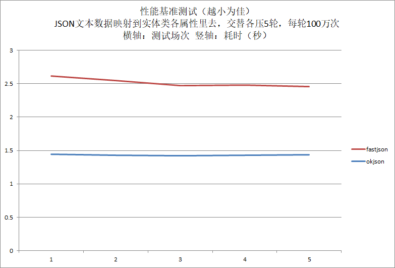
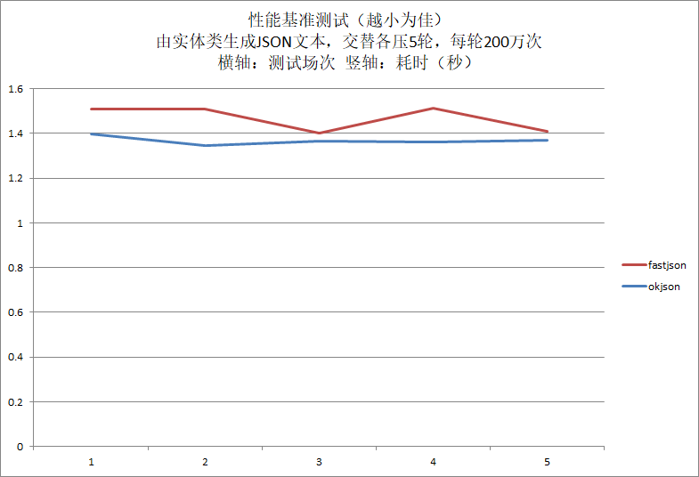

okjson - A small efficient flexible JSON parser/generator for Java
==================================================================

<!-- TOC -->

- [okjson - A small efficient flexible JSON parser/generator for Java](#okjson---a-small-efficient-flexible-json-parsergenerator-for-java)
- [1. Overview](#1-overview)
- [2. A demo](#2-a-demo)
	- [2.1. Write json file](#21-write-json-file)
	- [2.2. Write mapping class file](#22-write-mapping-class-file)
	- [2.3. Write demo](#23-write-demo)
- [3. Refenence](#3-refenence)
	- [3.1. Static mathod](#31-static-mathod)
		- [3.1.1. `OKJSON.getErrorCode`](#311-okjsongeterrorcode)
		- [3.1.2. `OKJSON.getErrorDesc`](#312-okjsongeterrordesc)
		- [3.1.3. `OKJSON.stringToObject`](#313-okjsonstringtoobject)
		- [3.1.4. `OKJSON.fileToObject`](#314-okjsonfiletoobject)
		- [3.1.5. `OKJSON.objectToString`](#315-okjsonobjecttostring)
		- [3.1.6. `OKJSON.objectToFile`](#316-okjsonobjecttofile)
	- [3.2. JSON element value mapping JAVA class/type](#32-json-element-value-mapping-java-classtype)
	- [3.3. JSON array simple-value mapping JAVA class/type](#33-json-array-simple-value-mapping-java-classtype)
- [3. Benchmark](#3-benchmark)
	- [fastjson](#fastjson)
	- [4.4. okjson](#44-okjson)
	- [4.5. Benchmarking](#45-benchmarking)
	- [4.6. Result](#46-result)
- [5. TODO](#5-todo)
- [6. About project](#6-about-project)
- [7. About author](#7-about-author)

<!-- /TOC -->

# 1. Overview

okjson is A small efficient flexible JSON parser/generator for Java

# 2. A demo

## 2.1. Write json file

demo.json
```
{
	"userName" : "Calvin" ,
	"email" : "calvinwilliams@163.com" ,
	"userExtInfo" : {
		"gender" : "M" ,
		"age" : 30 ,
		"address" : "I won't tell you"
	} ,
	"interestGroupList" : [
		"Programing", "Playing game", "Reading", "Sleeping"
	] ,
	"borrowDetailList" : [
		{
			"bookName" : "Thinking in JAVA" ,
			"author" : "Bruce Eckel" ,
			"borrowDate" : "2014-01-02" ,
			"borrowTime" : "17:30:00"
		} ,
		{
			"bookName" : "Thinking in C++" ,
			"author" : "Bruce Eckel too" ,
			"borrowDate" : "2014-02-04" ,
			"borrowTime" : "17:35:00"
		} ,
		{
			"bookName" : "Thinking in okjson" ,
			"author" : "It's me !!!" ,
			"borrowDate" : "2014-03-06" ,
			"borrowTime" : "17:40:00"
		}
	]
}
```

## 2.2. Write mapping class file

DemoUserClass.java

```
package xyz.calvinwilliams.okjson;

import java.time.LocalDate;
import java.time.LocalTime;
import java.util.LinkedList;

public class DemoUserClass {
	String				userName ;
	String				email ;
	UserExtInfo			userExtInfo ;
	LinkedList<String>			interestGroupList ;
	LinkedList<BorrowDetail>	borrowDetailList ;
}

class UserExtInfo {
	String				gender ;
	int					age ;
	String				address ;
}

class BorrowDetail {
	String				bookName ;
	String				author ;
	@OkJsonDateTimeFormatter(format="yyyy-MM-dd")
	LocalDate			borrowDate ;
	@OkJsonDateTimeFormatter(format="HH:mm:ss")
	LocalTime			borrowTime ;
}
```

## 2.3. Write demo

```
package xyz.calvinwilliams.okjson;

import java.time.format.DateTimeFormatter;

public class Demo {

	public static void printDemoUser( DemoUserClass demoUser ) {
		...
	}
	
	public static void main(String[] args) {
		DemoUserClass	demoUser = new DemoUserClass() ;
		
		System.out.println( "OKJSON.stringToObject ..." );
		demoUser = OKJSON.fileToObject( "demo.json", DemoUserClass.class, OKJSON.OKJSON_OTIONS_DIRECT_ACCESS_PROPERTY_ENABLE ) ;
		if( demoUser == null ) {
			System.out.println( "OKJSON.stringToObject failed["+OKJSON.getErrorCode()+"]["+OKJSON.getErrorDesc()+"]" );
			return;
		} else {
			System.out.println( "OKJSON.stringToObject ok" );
			printDemoUser( demoUser );
		}
	}
}
```

# 3. Refenence

## 3.1. Static mathod

### 3.1.1. `OKJSON.getErrorCode`

| | |
|---|---|
| Prototype | Integer getErrorCode(); |

### 3.1.2. `OKJSON.getErrorDesc`

| | |
|---|---|
| Prototype | String getErrorDesc(); |

### 3.1.3. `OKJSON.stringToObject`

| | |
|---|---|
| Prototype | <T> T stringToObject( String jsonString, Class<T> clazz, int options ); |

<p />

| options |
|---|
| OKJSON.OPTIONS_DIRECT_ACCESS_PROPERTY_ENABLE |
| OKJSON.OPTIONS_STRICT_POLICY |

<p />

| errcode |
|---|
| OKJSON_ERROR_END_OF_BUFFER | |
| OKJSON_ERROR_UNEXPECT | |
| OKJSON_ERROR_EXCEPTION | |
| OKJSON_ERROR_INVALID_BYTE | |
| OKJSON_ERROR_FIND_FIRST_LEFT_BRACE |
| OKJSON_ERROR_NAME_INVALID |
| OKJSON_ERROR_EXPECT_COLON_AFTER_NAME |
| OKJSON_ERROR_UNEXPECT_TOKEN_AFTER_LEFT_BRACE |
| OKJSON_ERROR_PORPERTY_TYPE_NOT_MATCH_IN_OBJECT |
| OKJSON_ERROR_NAME_NOT_FOUND_IN_OBJECT |
| OKJSON_ERROR_NEW_OBJECT |

### 3.1.4. `OKJSON.fileToObject`

| | |
|---|---|
| Prototype | <T> T fileToObject( String filePath, Class<T> clazz, int options ); |

### 3.1.5. `OKJSON.objectToString`

| | |
|---|---|
| Prototype | String objectToString( Object object, int options ); |

<p />

| options |
|---|
| OKJSON.OPTIONS_DIRECT_ACCESS_PROPERTY_ENABLE |
| OKJSON.OPTIONS_PRETTY_FORMAT_ENABLE |

<p />

| errcode |
|---|
| OKJSON_ERROR_END_OF_BUFFER |
| OKJSON_ERROR_EXCEPTION |
| OKJSON_ERROR_NEW_OBJECT |

### 3.1.6. `OKJSON.objectToFile`

| | |
|---|---|
| Prototype | int objectToFile( Object object, String filePath, int options ); |

## 3.2. JSON element value mapping JAVA class/type

| JSON element value | JAVA class/type |
|---|---|
| "..." | String |
| 123 | Byte或byte |
| 123 | Short或short |
| 123 | Integer或int |
| 123 | Long或long |
| 123.456 | Float或float |
| 123.456 | Double或double |
| true/false | Boolean或boolean |
| "..." | LocalDate |
| "..." | LocalTime |
| "..." | LocalDateTime |
| [...] | ArrayList |
| [...] | LinkedList |
| {...} | JAVA对象 |

## 3.3. JSON array simple-value mapping JAVA class/type

| JSON array simple-value | JAVA class/type |
|---|---|
| "..." | String |
| 123 | Byte |
| 123 | Short |
| 123 | Integer |
| 123 | Long |
| 123.456 | Float |
| 123.456 | Double |
| true/false | Boolean |
| "..." | LocalDate |
| "..." | LocalTime |
| "..." | LocalDateTime |
| {...} | JAVA对象 |

# 3. Benchmark

CPU : Intel Core i5-7500 3.4GHz 3.4GHz
Momey : 16GB
OS : WINDOWS 10
JAVA IDE : Eclipse 2018-12

`press.json`
```
{
	"str1" : "str1" ,
	"int1" : 1234 ,
	"double1" : 1.234 ,
	"boolean1" : true ,
	
	"press2" : {
		"byte2" : 2 ,
		"short2" : 23 ,
		"long2" : 23456789 ,
		"float2" : 2.345
	}
}
```

`PressDataClass.java`
```
package xyz.calvinwilliams.test_jsonparser;

public class PressDataClass {
	private String			str1 ;
	private int				int1 ;
	private Double			double1 ;
	private boolean			boolean1 ;
	private String			null1 ;
	public PressDataClass2	press2 ;
	
	public String getStr1() {
		return str1;
	}
	public void setStr1(String str1) {
		this.str1 = str1;
	}

	public int getInt1() {
		return int1;
	}
	public void setInt1(int int1) {
		this.int1 = int1;
	}

	public Double getDouble1() {
		return double1;
	}
	public void setDouble1(Double double1) {
		this.double1 = double1;
	}

	public boolean isBoolean1() {
		return boolean1;
	}
	public void setBoolean1(boolean boolean1) {
		this.boolean1 = boolean1;
	}

	public PressDataClass2 getPress2() {
		return press2;
	}
	public void setPress2(PressDataClass2 press2) {
		this.press2 = press2;
	}
	
	public String getNull1() {
		return null1;
	}
	public void setNull1(String null1) {
		this.null1 = null1;
	}
}
```

`PressDataClass2.java`
```
package xyz.calvinwilliams.test_jsonparser;

public class PressDataClass2 {
	private byte		byte2 ;
	private short		short2 ;
	private Long		long2 ;
	private float		float2 ;
	
	public byte getByte2() {
		return byte2;
	}
	public void setByte2(byte byte2) {
		this.byte2 = byte2;
	}
	
	public short getShort2() {
		return short2;
	}
	public void setShort2(short short2) {
		this.short2 = short2;
	}
	
	public Long getLong2() {
		return long2;
	}
	public void setLong2(Long long2) {
		this.long2 = long2;
	}
	
	public float getFloat2() {
		return float2;
	}
	public void setFloat2(float float2) {
		this.float2 = float2;
	}
}
```

## fastjson

`PressFastJsonParser.java`
```
package xyz.calvinwilliams.test_jsonparser;

import java.io.File;
import java.io.FileInputStream;

import com.alibaba.fastjson.*;

public class PressFastJsonParser {

	public static void main(String[] args) {
		
		File file = new File( "press.json" ) ;
		Long fileSize = file.length() ;
		byte[] json = new byte[fileSize.intValue()] ;
		try {
			FileInputStream in = new FileInputStream(file);
			in.read(json);
			in.close();
		} catch (Exception e) {
			e.printStackTrace();
			return;
		}
		String jsonString = new String(json) ;
		
		long l , count = 1000000 ;
		long beginMillisSecondstamp = System.currentTimeMillis() ;
		
		for( l = 0 ; l < count ; l++ ) {
			PressDataClass obj = JSON.parseObject(jsonString, new TypeReference<PressDataClass>() {}) ;
			if( obj == null ) {
				System.out.println( "JSON.stringToObject failed" );
				return;
			}
			else if( l == 0 ){
				System.out.println( "JSON.stringToObject ok" );
				
				System.out.println( "------------------------------ dump PressDataClass" );
				System.out.println( "DataClass.str1["+obj.getStr1()+"]" );
				System.out.println( "PressDataClass.int1["+obj.getInt1()+"]" );
				System.out.println( "PressDataClass.Double1["+obj.getDouble1()+"]" );
				System.out.println( "PressDataClass.boolean1["+obj.isBoolean1()+"]" );
				
				System.out.println( "------------------------------ dump PressDataClass.press2" );
				if( obj.press2 != null ) {
					System.out.println( "PressDataClass.branch2.byte2["+obj.press2.getByte2()+"]" );
					System.out.println( "PressDataClass.branch2.short2["+obj.press2.getShort2()+"]" );
					System.out.println( "PressDataClass.branch2.Long2["+obj.press2.getLong2()+"]" );
					System.out.println( "PressDataClass.branch2.float2["+obj.press2.getFloat2()+"]" );
				}
			}
		}
		
		long endMillisSecondstamp = System.currentTimeMillis() ;
		double elpaseSecond = (endMillisSecondstamp-beginMillisSecondstamp)/1000.0 ;
		System.out.println( "count["+count+"] elapse["+elpaseSecond+"]s" );
		double countPerSecond = count / elpaseSecond ;
		System.out.println( "count per second["+countPerSecond+"]" );
		
		return;
	}
}
```

`PressFastJsonGenerator.java`
```
package xyz.calvinwilliams.test_jsonparser;

import java.io.File;
import java.io.FileInputStream;

import com.alibaba.fastjson.*;

public class PressFastJsonGenerator {

	public static void main(String[] args) {
		
		PressDataClass	object = new PressDataClass() ;
		
		object.setStr1("str1");
		object.setInt1(1234);
		object.setDouble1(1.234);
		object.setBoolean1(true);
		object.setNull1(null);
		
		object.press2 = new PressDataClass2() ;
		object.press2.setByte2((byte)2);
		object.press2.setShort2((short)23);
		object.press2.setLong2(23456789L);
		object.press2.setFloat2(2.345f);
		
		System.out.println( "------------------------------ dump PressDataClass" );
		System.out.println( "DataClass.str1["+object.getStr1()+"]" );
		System.out.println( "PressDataClass.int1["+object.getInt1()+"]" );
		System.out.println( "PressDataClass.Double1["+object.getDouble1()+"]" );
		System.out.println( "PressDataClass.boolean1["+object.isBoolean1()+"]" );
		System.out.println( "PressDataClass.null1["+object.getNull1()+"]" );
		
		System.out.println( "------------------------------ dump PressDataClass.press2" );
		if( object.press2 != null ) {
			System.out.println( "PressDataClass.branch2.byte2["+object.press2.getByte2()+"]" );
			System.out.println( "PressDataClass.branch2.short2["+object.press2.getShort2()+"]" );
			System.out.println( "PressDataClass.branch2.Long2["+object.press2.getLong2()+"]" );
			System.out.println( "PressDataClass.branch2.float2["+object.press2.getFloat2()+"]" );
		}
		
		long l , count = 5000000 ;
		long beginMillisSecondstamp = System.currentTimeMillis() ;
		
		for( l = 0 ; l < count ; l++ ) {
			String jsonString = JSON.toJSONString( object ) ;
			if( jsonString == null ) {
				System.out.println( "JSON.toJSONString failed" );
				return;
			}
			else if( l == count-1 ){
				System.out.println( "JSON.toJSONString ok" );
				System.out.println( jsonString );
			}
		}
		
		long endMillisSecondstamp = System.currentTimeMillis() ;
		double elpaseSecond = (endMillisSecondstamp-beginMillisSecondstamp)/1000.0 ;
		System.out.println( "count["+count+"] elapse["+elpaseSecond+"]s" );
		double countPerSecond = count / elpaseSecond ;
		System.out.println( "count per second["+countPerSecond+"]" );
		
		return;
	}
}
```

## 4.4. okjson

`PressOkJsonParser.java`
```
package xyz.calvinwilliams.test_jsonparser;

import java.io.File;
import java.io.FileInputStream;

import xyz.calvinwilliams.okjson.*;
import xyz.calvinwilliams.test_jsonparser.PressDataClass;

public class PressOkJsonParser {

	public static void main(String[] args) {
		
		File file = new File( "press.json" ) ;
		Long fileSize = file.length() ;
		byte[] json = new byte[fileSize.intValue()] ;
		try {
			FileInputStream in = new FileInputStream(file);
			in.read(json);
			in.close();
		} catch (Exception e) {
			e.printStackTrace();
			return;
		}
		String jsonString = new String(json) ;
		
		long l , count = 1000000 ;
		long beginMillisSecondstamp = System.currentTimeMillis() ;
		
		for( l = 0 ; l < count ; l++ ) {
			PressDataClass object = OKJSON.stringToObject( jsonString, PressDataClass.class, OKJSON.OPTIONS_DIRECT_ACCESS_PROPERTY_ENABLE ) ;
			if( object == null ) {
				System.out.println( "okjson.stringToObject failed["+OKJSON.getErrorCode()+"]" );
				return;
			} else if( l == 0 ){
				System.out.println( "okjson.stringToObject ok" );
				
				System.out.println( "------------------------------ dump PressDataClass" );
				System.out.println( "DataClass.str1["+object.getStr1()+"]" );
				System.out.println( "PressDataClass.int1["+object.getInt1()+"]" );
				System.out.println( "PressDataClass.Double1["+object.getDouble1()+"]" );
				System.out.println( "PressDataClass.boolean1["+object.isBoolean1()+"]" );
				
				System.out.println( "------------------------------ dump PressDataClass.press2" );
				if( object.press2 != null ) {
					System.out.println( "PressDataClass.branch2.byte2["+object.press2.getByte2()+"]" );
					System.out.println( "PressDataClass.branch2.short2["+object.press2.getShort2()+"]" );
					System.out.println( "PressDataClass.branch2.Long2["+object.press2.getLong2()+"]" );
					System.out.println( "PressDataClass.branch2.float2["+object.press2.getFloat2()+"]" );
				}
			}
		}
		
		long endMillisSecondstamp = System.currentTimeMillis() ;
		double elpaseSecond = (endMillisSecondstamp-beginMillisSecondstamp)/1000.0 ;
		System.out.println( "count["+count+"] elapse["+elpaseSecond+"]s" );
		double countPerSecond = count / elpaseSecond ;
		System.out.println( "count per second["+countPerSecond+"]" );
		
		return;
	}
}
```

`PressOkJsonGenerator.java`
```
package xyz.calvinwilliams.test_jsonparser;

import java.io.File;
import java.io.FileInputStream;

import xyz.calvinwilliams.okjson.OKJSON;
import xyz.calvinwilliams.test_jsonparser.PressDataClass;

public class PressOkJsonGenerator {

	public static void main(String[] args) {
		
		PressDataClass	object = new PressDataClass() ;
		
		object.setStr1("str1");
		object.setInt1(1234);
		object.setDouble1(1.234);
		object.setBoolean1(true);
		object.setNull1(null);
		
		object.press2 = new PressDataClass2() ;
		object.press2.setByte2((byte)2);
		object.press2.setShort2((short)23);
		object.press2.setLong2(23456789L);
		object.press2.setFloat2(2.345f);
		
		System.out.println( "------------------------------ dump PressDataClass" );
		System.out.println( "DataClass.str1["+object.getStr1()+"]" );
		System.out.println( "PressDataClass.int1["+object.getInt1()+"]" );
		System.out.println( "PressDataClass.Double1["+object.getDouble1()+"]" );
		System.out.println( "PressDataClass.boolean1["+object.isBoolean1()+"]" );
		System.out.println( "PressDataClass.null1["+object.getNull1()+"]" );
		
		System.out.println( "------------------------------ dump PressDataClass.press2" );
		if( object.press2 != null ) {
			System.out.println( "PressDataClass.branch2.byte2["+object.press2.getByte2()+"]" );
			System.out.println( "PressDataClass.branch2.short2["+object.press2.getShort2()+"]" );
			System.out.println( "PressDataClass.branch2.Long2["+object.press2.getLong2()+"]" );
			System.out.println( "PressDataClass.branch2.float2["+object.press2.getFloat2()+"]" );
		}
		
		long l , count = 5000000 ;
		long beginMillisSecondstamp = System.currentTimeMillis() ;
		
		for( l = 0 ; l < count ; l++ ) {
			String jsonString = OKJSON.objectToString( object, 0 ) ;
			if( jsonString == null ) {
				System.out.println( "okjson.stringToObject failed["+OKJSON.getErrorCode()+"]["+OKJSON.getErrorDesc()+"]" );
				return;
			} else if( l == count-1 ){
				System.out.println( "okjson.stringToObject ok" );
				System.out.println( jsonString );
			}
		}
		
		long endMillisSecondstamp = System.currentTimeMillis() ;
		double elpaseSecond = (endMillisSecondstamp-beginMillisSecondstamp)/1000.0 ;
		System.out.println( "count["+count+"] elapse["+elpaseSecond+"]s" );
		double countPerSecond = count / elpaseSecond ;
		System.out.println( "count per second["+countPerSecond+"]" );
		
		return;
	}
}
```

## 4.5. Benchmarking

JSON Parser benchmarking

okjson
```
count[1000000] elapse[1.446]s
count per second[691562.9322268326]
```

fastjson
```
count[1000000] elapse[2.616]s
count per second[382262.996941896]
```

okjson
```
count[1000000] elapse[1.429]s
count per second[699790.0629811056]
```

fastjson
```
count[1000000] elapse[2.547]s
count per second[392618.767177071]
```

okjson
```
count[1000000] elapse[1.42]s
count per second[704225.3521126761]
```

fastjson
```
count[1000000] elapse[2.473]s
count per second[404367.1653861707]
```

okjson
```
count[1000000] elapse[1.432]s
count per second[698324.0223463688]
```

fastjson
```
count[1000000] elapse[2.48]s
count per second[403225.8064516129]
```

okjson
```
count[1000000] elapse[1.434]s
count per second[697350.069735007]
```

fastjson
```
count[1000000] elapse[2.459]s
count per second[406669.37779585196]
```

JSON Generator benchmarking

okjson
```
count[2000000] elapse[1.399]s
count per second[1429592.5661186562]
```

fastjson
```
count[2000000] elapse[1.51]s
count per second[1324503.311258278]
```

okjson
```
count[2000000] elapse[1.347]s
count per second[1484780.9948032666]
```

fastjson
```
count[2000000] elapse[1.507]s
count per second[1327140.0132714002]
```

okjson
```
count[2000000] elapse[1.364]s
count per second[1466275.6598240468]
```

fastjson
```
count[2000000] elapse[1.403]s
count per second[1425516.7498218103]
```

okjson
```
count[2000000] elapse[1.363]s
count per second[1467351.4306676448]
```

fastjson
```
count[2000000] elapse[1.512]s
count per second[1322751.3227513228]
```

okjson
```
count[2000000] elapse[1.37]s
count per second[1459854.01459854]
```

fastjson
```
count[2000000] elapse[1.409]s
count per second[1419446.4158978]
```

## 4.6. Result





# 5. TODO

* Support more field type, for example : JAVA old-version Date Time class
* XML Parser, Generator

# 6. About project

Download source at : [gitee](https://gitee.com/calvinwilliams/okjson)、[github](https://github.com/calvinwilliams/okjson)

Apache Maven
```
<dependency>
  <groupId>xyz.calvinwilliams</groupId>
  <artifactId>okjson</artifactId>
  <version>0.0.9.0</version>
</dependency>
```

Gradle Kotlin DSL
```
compile("xyz.calvinwilliams:okjson:0.0.9.0")
```

# 7. About author

Mailto : [netease](mailto:calvinwilliams@163.com)、[Gmail](mailto:calvinwilliams.c@gmail.com)
